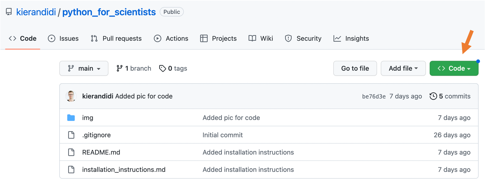

# Python for Scientists Course

Heidelberg University, winter semester 2023/24, organised by [Kieran Didi](https://github.com/kierandidi).

UPDATE: The material for the advanced course in the summer semester 2023 is available [here](https://github.com/kierandidi/advanced_python_for_scientists)

Dear all, 

this is the repository that we will use during our course. 

You can download it by clicking on the green "_CODE_" button and choosing "Download ZIP".

Make sure to not change the folder structure of the repository or else some image links might get broken and not work anymore.

For questions write in the course discord or drop me a mail: kieran.didi@stud.uni-heidelberg.de

## Overview of the course

**18.11**|**19.11**|**25.11**|**26.11**
:-----:|:-----:|:-----:|:-----:
*Python I*|*Python II*|*Pandas*|*Seaborn*
Variables and Data Types|Loops/Comprehensions|Basic Pandas|Basic Plotting/Plot Types
Conditionals|Dictionaries|Clean/Filter Data|Plot Customization
Lists|Functions|Aggregate/Apply/GroupBy| Plotly/GIFs/Animations

## Exercises

For the second weekend, choose one of these five exercises to work on:

1. [Make a Gradebook with Python & pandas](https://realpython.com/pandas-project-gradebook/#calculating-grades-with-pandas-dataframes)

2. [Build a Quiz Application with Python](https://realpython.com/python-quiz-application/#provide-multiple-choices)

3. [Instagram Reach Analysis using Python](https://thecleverprogrammer.com/2022/03/22/instagram-reach-analysis-using-python/)

4. [Flight Price Prediction](https://machinelearningprojects.net/flight-price-prediction/)

5. Your own project idea!